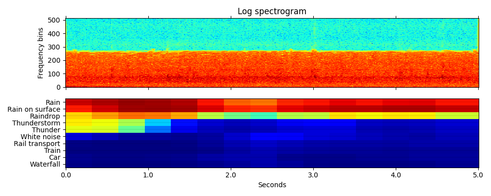

# FuSA PANN

## Instalación
El código está desarrollado en Python 3.8. Para instalar las librerías necesarias, siga las instrucciones:
```
virtualenv venv
source venv/bin/activate
pip install -r requirements.txt
```

## Audio tagging usando modelos preentrenados
Primero, debes descargar un modelo preentrenados desde https://zenodo.org/record/3987831, por ejemplo, el modelo llamado "Cnn14_DecisionLevelAtt_mAP=0.425.pth".
Luego, edita el archivo bash *inference_audio_tagging.sh*:
```
MODEL_TYPE="Cnn14_DecisionLevelAtt"
CHECKPOINT_PATH="models/Cnn14_DecisionLevelAtt_mAP=0.425.pth"
AUDIO_PATH="resources/dog_bark.wav"

python3 pytorch/inference.py audio_tagging \
    --model_type=$MODEL_TYPE \
    --checkpoint_path=$CHECKPOINT_PATH \
    --audio_path=$AUDIO_PATH \
    --cuda
```
*Todos los parámetros posibles se encuentran descritos en pytorch/inference.py*

Corre el archivo bash

```
bash fusa_scripts/inference_audio_tagging.sh
```

El resultado debería desplegar en terminal algo como lo siguiente:
```
Speech: 0.893
Telephone bell ringing: 0.754
Inside, small room: 0.235
Telephone: 0.183
Music: 0.092
Ringtone: 0.047
Inside, large room or hall: 0.028
Alarm: 0.014
Animal: 0.009
Vehicle: 0.008
embedding: (2048,)
```

Si por ejemplo, desea utilizar un modelo para un samplerate de 16kHz, descarga el modelo preentrenado *Cnn14_16k_mAP=0.438.pth*, y edita los parámetros como sigue:
```
CHECKPOINT_PATH="Cnn14_16k_mAP=0.438.pth"   # Trained by a later code version, achieves higher mAP than the paper.
MODEL_TYPE="Cnn14_16k"
AUDIO_PATH="resources/dog_bark.wav"
CUDA_VISIBLE_DEVICES=0 python3 pytorch/inference.py audio_tagging \
    --sample_rate=16000 \
    --window_size=512 \
    --hop_size=160 \
    --mel_bins=64 \
    --fmin=50 \
    --fmax=8000 \
    --model_type=$MODEL_TYPE \
    --checkpoint_path=$CHECKPOINT_PATH \
    --audio_path=$AUDIO_PATH \
    --cuda
```

## Sound event detection usando modelos preentrenados
Sólo algunos de los modelos PANNs, como *DecisionLevelMax (the best), DecisionLevelAvg y DecisionLevelAtt* pueden ser utilizados para Sound Event Detection.
Primero descarga uno de estos modelos desde https://zenodo.org/record/3987831, y edita el archivo bash *inference_sed.sh*, que debería contener lo siguiente:

```
MODEL_TYPE="Cnn14_DecisionLevelAtt"
CHECKPOINT_PATH="models/Cnn14_DecisionLevelAtt_mAP=0.425.pth"
AUDIO_PATH="resources/rain.wav"

python3 pytorch/inference.py sound_event_detection \
    --model_type=$MODEL_TYPE \
    --checkpoint_path=$CHECKPOINT_PATH \
    --audio_path=$AUDIO_PATH \
    --cuda
```
*Todos los parámetros posibles se encuentran descritos en pytorch/inference.py*

Corre el archivo bash

```
bash fusa_scripts/inference_sed.sh
```

El resultado de SED debería desplegarse en una imagen como la siguiente:
